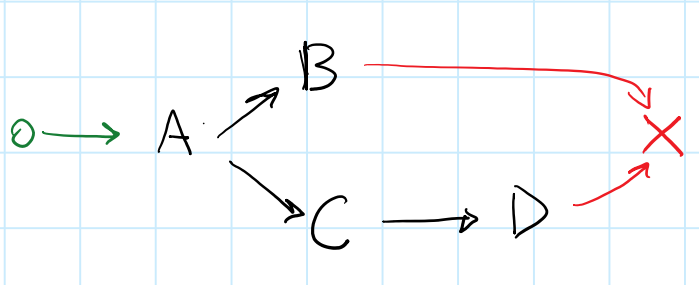

# vertx-futures



__Work In Progress__

For users of Vert.x in Java.

Helps you write legible asynchronous logic with elegance, efficiency and flair.

Inspired by the [Promises/A+](https://promisesaplus.com/) specification.

## Goals:

* Efficient: for developers and computers
* Typesafe *Composition*
* Typesafe *Destructuring*
* Simple API: *when*, *then*, *onSuccess*, *onFail*, *onComplete*, *peek*, *map*
* Keeps with `io.vertx.core.Future` naming convention 

## Simple Example

```java
    when(getId())
      .then2(id -> all(getName(id), getAge(id)))
      .then((name, age) -> composeMessage(name, age))
      .onSuccess(result -> LOG.info(result))
      .onFail(cause -> LOG.error("error handler", cause));

```

... more to follow ...


