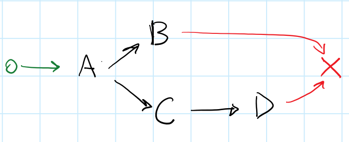

# vertx-futures

[](https://travis-ci.org/dazraf/vertx-futures)
[](https://coveralls.io/github/dazraf/vertx-futures?branch=master)



__Work In Progress__

For users of Vert.x in Java.

Helps you write legible asynchronous logic with elegance, efficiency and flair.

Inspired by the [Promises/A+](https://promisesaplus.com/) specification.

Main [Site](http://www.dazraf.io/vertx-futures/)

## Goals:

* Efficient: for developers and computers
* Typesafe *Composition* and *Decomposition*
* Simple API: *when*, *then*, *call*, *run*, *peek*, *map* etc
* Keeps with `io.vertx.core.Future` naming convention 

## Simple Example

```java
    when(getId())
        .then(call(id -> when(getName(id), getAge(id))))
        .then(call((name, age) -> composeMessage(name, age)))
        .then(run(result -> LOG.info(result)))
        .then(runOnFail(cause -> LOG.error("error handler", cause)));
```

For more, please refer to the main [site](http://www.dazraf.io/vertx-futures/).

